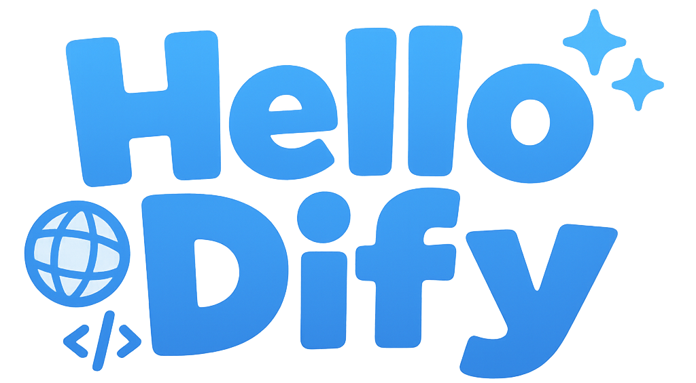

# Hello Dify

<p align="center">
  <a href="README.md">English</a> |
  <a href="README.zh.md">中文</a> |
  <a href="README.ja.md">日本語</a> |
  <a href="README.pt.md">Português</a>
</p>

<p align="center">
  <a href="https://discord.gg/PwZDHH4mv3"></a>
  <a href="https://twitter.com/FirstLabAI"></a>
</p>

<p align="center">
  
</p>

<p align="center">
  Difyを使用したAIワークフローとアプリケーション構築のための無料オンラインチュートリアル、ガイド、ベストプラクティス。
</p>

<p align="center">
  <a href="https://hellodify.com">今すぐアクセス</a>
  ·
  <a href="https://github.com/stvlynn/hello-dify/issues">バグを報告</a>
  ·
  <a href="https://github.com/stvlynn/hello-dify/issues">ユースケースを提供</a>
</p>

## これは何ですか？

Hello Difyはドキュメントウェブサイトです。次の役割を果たします：

- **学習リソース**：Difyプラグイン開発のためのチュートリアルとベストプラクティスのコレクション
- **リファレンス実装**：Fumadocsの機能を示すモダンでレスポンシブなウェブサイト
- **コミュニティプロジェクト**：FirstLabコミュニティメンバーによる共同作業
- **インタラクティブドキュメント**：実践的に学ぶためのリアルタイムデモを含む

## 特徴

- 🌐 **多言語サポート**：英語、中国語、日本語で利用可能
- 📱 **レスポンシブデザイン**：デスクトップ、タブレット、モバイルデバイスでシームレスに動作
- 🔍 **全文検索**：必要なコンテンツをすばやく見つける
- 🎨 **モダンUI**：ダークモードをサポートするクリーンでアクセスしやすいインターフェース
- 📚 **包括的なガイド**：初心者から上級ユーザーまでのステップバイステップチュートリアル

## 貢献する

Hello Difyに貢献したいですか？以下は貢献方法です：

- **フォークとクローン**：リポジトリをフォークしてローカルマシンにクローンする
- **コンテンツ作成**：文書構造に従って例や改善点を追加する
- **多言語サポート**：各ドキュメントの3つの言語バージョンを作成する必要があります：
  - 英語（基本バージョン）：`document.mdx`
  - 中国語：`document.zh.mdx`
  - 日本語：`document.ja.mdx`
- **変更をテスト**：`yarn build`を実行して正しくコンパイルされることを確認する（**コンパイル成功には3つの言語ファイルすべてが必要です**）
- **PRを提出**：ブランチを作成し、変更をプルリクエストとして提出する

詳細な貢献ガイドラインは、[貢献ドキュメント](content/docs/contributing.mdx)をご覧ください。

## 技術スタック

- **フレームワーク**：[Next.js](https://nextjs.org/)
- **ドキュメント**：[Fumadocs](https://fumadocs.vercel.app/)
- **スタイリング**：[Tailwind CSS](https://tailwindcss.com/)
- **アイコン**：[Remix Icon](https://remixicon.com/)
- **デプロイメント**：[Vercel](https://vercel.com/)

## FirstLabに参加する

FirstLabはAI開発とDifyエコシステムに興味を持つ開発者のコミュニティです。

- **Discord**：[Discordサーバー](https://discord.gg/PwZDHH4mv3)に参加して他の開発者と繋がる
- **X (Twitter)**：更新情報を得るために[@FirstLabAI](https://twitter.com/FirstLabAI)をフォロー

## プロジェクト構造

```
hello-dify/
├── app/                  # Next.jsアプリディレクトリ
│   ├── [lang]/           # 多言語ルート処理
│   ├── api/              # APIルート
│   └── global.css        # グローバルスタイル
├── content/              # ドキュメントコンテンツ（MDXファイル）
│   ├── docs/             # メインドキュメント
│   ├── plugin/           # プラグイン特有のドキュメント
│   └── workflow/         # ワークフローガイド
├── public/               # 静的アセット
│   └── images/           # 画像ファイル
└── lib/                  # 共有ユーティリティ
    └── fumadocs/         # ドキュメント設定
```

## 貢献者

[](https://github.com/stvlynn/hello-dify/graphs/contributors)

## ライセンス

このプロジェクトは[CC-BY-SA-4.0](./LICENSE)の下でライセンスされています。

## サポート

このプロジェクトが役立つと思われる場合は、以下をご検討ください：

- リポジトリにスターを付ける ⭐
- 利益を得られる可能性のある人と共有する
- [コーヒーを買ってくれる](https://www.buymeacoffee.com/stvlynn) ☕ 