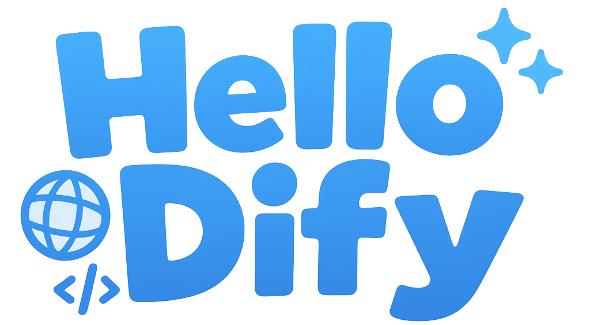

# Hello Dify

<p align="center">
  
</p>

<p align="center">
  A FirstLab project designed to help newcomers quickly learn Dify through best practices.
</p>

<p align="center">
  <a href="https://hellodify.com">Visit Now</a>
  ·
  <a href="https://github.com/stvlynn/hello-dify/issues">Report Bug</a>
  ·
  <a href="https://github.com/stvlynn/hello-dify/issues">Request Feature</a>
</p>

## What is this?

Hello Dify is a documentation website. It serves as:

- **Learning Resource**: A collection of tutorials and best practices for Dify plugin development
- **Reference Implementation**: A modern, responsive website demonstrating Fumadocs capabilities
- **Community Project**: A collaborative effort by FirstLab community members
- **Interactive Documentation**: Includes real-time interactive demos to help you learn by doing

## Features

- 🌐 **Multilingual Support**: Available in English, Chinese, and Japanese
- 📱 **Responsive Design**: Works seamlessly on desktop, tablet, and mobile devices
- 🔍 **Full-text Search**: Quickly find the content you need
- 🎨 **Modern UI**: Clean, accessible interface with dark mode support
- 📚 **Comprehensive Guides**: Step-by-step tutorials for beginners and advanced users


## Technology Stack

- **Framework**: [Next.js](https://nextjs.org/)
- **Documentation**: [Fumadocs](https://fumadocs.vercel.app/)
- **Styling**: [Tailwind CSS](https://tailwindcss.com/)
- **Icons**: [Remix Icon](https://remixicon.com/)
- **Deployment**: [Vercel](https://vercel.com/)

## Join FirstLab

FirstLab is a community of developers interested in AI development and Dify ecosystem.

- **Discord**: Join our [Discord server](https://discord.gg/drd3HnTv) to connect with other developers
- **X (Twitter)**: Follow [@FirstLabAI](https://twitter.com/FirstLabAI) for updates

## Project Structure

```
hello-dify/
├── app/                  # Next.js app directory
│   ├── [lang]/           # Multilingual route handling
│   ├── api/              # API routes
│   └── global.css        # Global styles
├── content/              # Documentation content (MDX files)
│   ├── docs/             # Main documentation
│   ├── plugin/           # Plugin-specific documentation
│   └── workflow/         # Workflow guides
├── public/               # Static assets
│   └── images/           # Image files
└── lib/                  # Shared utilities
    └── fumadocs/         # Documentation configuration
```

## Contributors

[](https://github.com/stvlynn/hello-dify/graphs/contributors)

Want to contribute? Check out our [contribution guidelines](CONTRIBUTING.md).

## License

This project is licensed under [CC-BY-SA-4.0](./LICENSE).

## Support

If you find this project helpful, consider:

- Starring the repository ⭐
- Sharing it with others who might benefit
- [Buying me a coffee](https://www.buymeacoffee.com/stvlynn) ☕